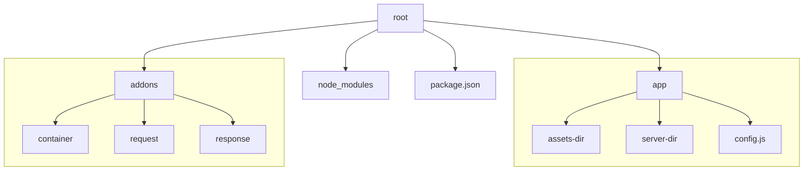

# xerex.js

## overview

Fast, unopinionated, minimalist web framework for [Node.js](http://nodejs.org).

```js
// <appName>/config.js

const xerex = require("xerex"),
  app = xerex();

app.listen(...args);
```

## Project(s) Structure

┌ node_modules <br />
├─── addons <br />
     ┌ container <br />
       ├ index.js <br />
     ├ request <br />
       ├ index.js <br />
     ├ response <br />
       ├ index.js <br />
├─── app <br />
     ┌ assets <br />
     ├ server <br />
       ├ get.js <br />
       └ index.js <br />
     └ config.js <br />
└ package.json



!!!/ and you can add as many apps as you want in the root directory

## Installation

This is a [Node.js](https://nodejs.org/en/) module available through the [npm registry](https://www.npmjs.com/).

Before installing, [download and install Node.js](https://nodejs.org/en/download/).

If this is a brand new project, make sure to create a `package.json` first with
the [`npm init` command](https://docs.npmjs.com/creating-a-package-json-file).

Installation is done using the
[`npm install` command](https://docs.npmjs.com/getting-started/installing-npm-packages-locally):

```console
$ npm install xerex
```

<!-- ## Features

-  -->

## Quick Start

```console
$ npm install xerex
```

Create the app:

```console
$ express /tmp/foo && cd /tmp/foo
```

Install dependencies:

```console
$ npm install
```

Start the server:

```console
$ npm start
```

View the website at: http://localhost:3000

## Philosophy

xerex philosophy is to provide small, extendable, robust tooling for HTTP servers making it a great solution for single page applications, websites, HTTP APIs.

## Examples

To view the examples, clone the Express repo and install the dependencies:

```console
$ git clone https://github.com/expressjs/express.git --depth 1
$ cd express
$ npm install
```
